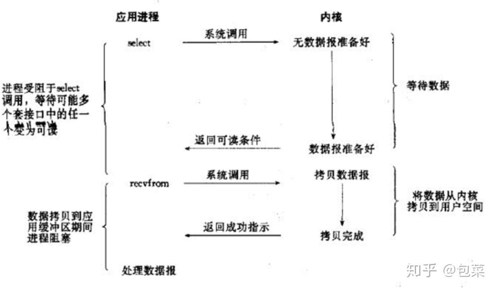

#这是一个Java NIO测试demo

TestBuffer.java 测试Buffer

TestChannel.java 测试通道

TestBlockNIO.java 测试未使用selector时的阻塞型I/O

TestNonBlockNIO.java 测试使用selector时的非阻塞型I/O (TCP)

TestNonBlockNIO2.java 测试使用selector时的非阻塞型I/O (UDP)

TestPipe.java 测试管道

学习链接：https://blog.csdn.net/zxm1306192988/article/details/60581173

I/O类型：
    1、阻塞型I/O ： 阻塞IO会一直等待，直到磁盘空间IO过程结束
    
    2、非阻塞型I/O ：非阻塞IO会立马返回，不断的主动发起check来检查IO是否可用
    
    3、多路复用IO ： 用一个线程专门监控所有的通道，一有可用的就立马通知相关的线程(即多路复用器只监听IO状态，具体的读写操作依旧是由用户触发的)
    
    4、信号驱动IO ： 由系统通知用户线程
    
    5、异步IO：有操作系统主动将数据拷贝到用户内存中，程序可直接使用。
    

阻塞/非阻塞IO ：强调线程是否需要等待磁盘空间完成IO操作。以上除了第一种，其他的都属于非阻塞IO

异步/同步IO ： 强调是否需要用户主动完成数据从内科空间到用户空间的拷贝。以上除了第5中都属于同步IO
    
